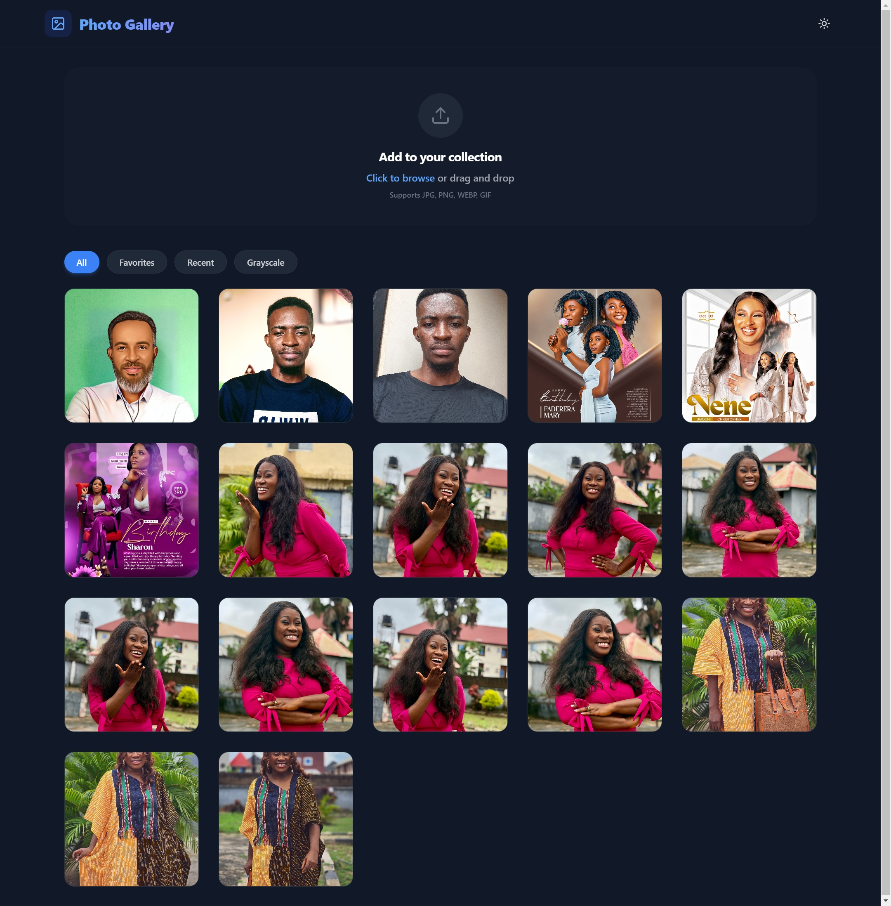
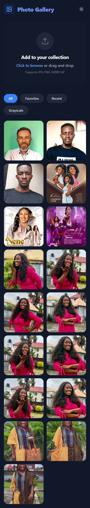
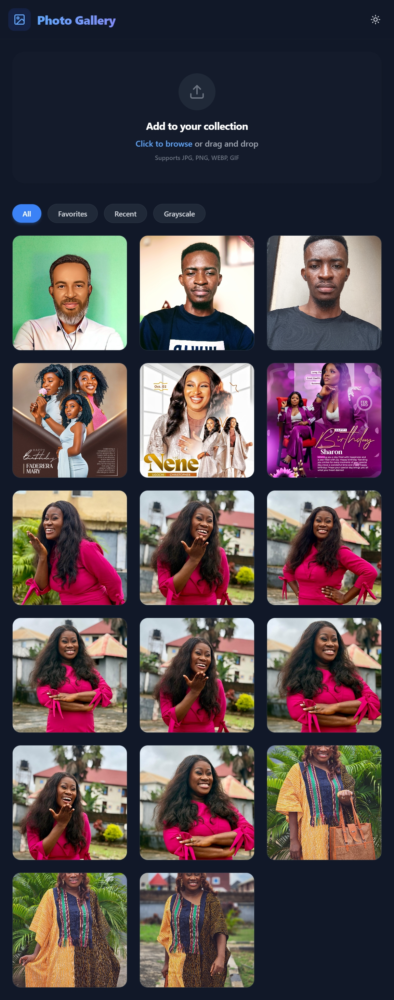

# CodeAlpha Photo Gallery

This is a solution for the CodeAlpha Photo Gallery project. This project serves to demonstrate a modern, responsive, and interactive photo gallery application built with React and Vite.

## Table of contents

- [Overview](#overview)
  - [The challenge](#the-challenge)
  - [Screenshots](#screenshots)
  - [Links](#links)
- [My process](#my-process)
  - [Built with](#built-with)
  - [What I learned](#what-i-learned)
  - [Continued development](#continued-development)
  - [Useful resources](#useful-resources)
- [Author](#author)
- [Getting Started](#getting-started)
  - [Installation](#installation)
  - [Running the App](#running-the-app)
  - [Building for Production](#building-for-production)

## Overview

This project is a responsive web application that provides a comprehensive interface for viewing and interacting with a photo gallery. Built with React and modern CSS frameworks, it allows users to browse beautiful images in a responsive grid layout, filter them smoothly, and engage with individual photos via a full-screen viewer with zoom, pan, and pinch capabilities. Every detail has been crafted to provide a highly interactive and premium user experience on mobile, tablet, and desktop devices.

### The challenge

Users should be able to:

- View a responsive grid of images that adapts to different screen sizes.
- Filter images smoothly with category transitions.
- Click on any image to open it in a full-screen interactive viewer.
- Zoom, pan, and pinch images within the interactive viewer.
- Experience high-quality animations and micro-interactions across the gallery.

### Screenshots








### Links

- Solution URL: [Add solution URL here](https://your-solution-url.com)
- Live Site URL: [Add live site URL here](https://your-live-site-url.com)

## My process

### Built with

- Semantic HTML5 markup
- Mobile-first workflow
- [React 19](https://react.dev/) - JS Library
- [TypeScript](https://www.typescriptlang.org/) - For type safety
- [Tailwind CSS](https://tailwindcss.com/) - For styling
- [Framer Motion](https://www.framer.com/motion/) - For animations
- [react-zoom-pan-pinch](https://prc5.github.io/react-zoom-pan-pinch/) - For the interactive image viewer
- [Lucide React](https://lucide.dev/) - For SVG icons
- [Vite](https://vitejs.dev/) - Frontend Tooling

### What I learned

During this project, I focused on implementing a robust, component-based architecture for an interactive gallery. I learned how to seamlessly integrate complex libraries like `framer-motion` for fluid layout animations and `react-zoom-pan-pinch` for advanced user interactions.

```tsx
// Example of implementing interactive zoom/pan functionality
import { TransformWrapper, TransformComponent } from "react-zoom-pan-pinch";

export const InteractiveViewer = ({ imageSrc }) => (
  <TransformWrapper initialScale={1}>
    {({ zoomIn, zoomOut, resetTransform }) => (
      <>
        <div className="tools">
          <button onClick={() => zoomIn()}>+</button>
          <button onClick={() => zoomOut()}>-</button>
          <button onClick={() => resetTransform()}>x</button>
        </div>
        <TransformComponent>
          
        </TransformComponent>
      </>
    )}
  </TransformWrapper>
);
```

### Continued development

In future projects, I want to explore:
- Fetching images dynamically from external APIs like Unsplash or Pexels.
- Implementing infinite scrolling for larger galleries.
- Adding features for users to upload or "favorite" specific images.

### Useful resources

- [Framer Motion Documentation](https://www.framer.com/motion/) - Helped with understanding layout animations and complex transitions.
- [React Zoom Pan Pinch](https://prc5.github.io/react-zoom-pan-pinch/) - Excellent library for adding intuitive image interactions.
- [Tailwind CSS Documentation](https://tailwindcss.com/docs) - Invaluable for building responsive layouts swiftly.

## Author

- CodeAlpha Project
- Twitter - [@yourusername](https://www.twitter.com/yourusername)

## Getting Started

### Installation

1. Clone the repository:
   ```bash
   git clone https://github.com/yourusername/image-gallery.git
   ```
2. Navigate to the project directory:
   ```bash
   cd "Image Gallery"
   ```
3. Install dependencies:
   ```bash
   npm install
   ```

### Running the App

Start the development server:
```bash
npm run dev
```

### Building for Production

Build the project for production:
```bash
npm run build
```
